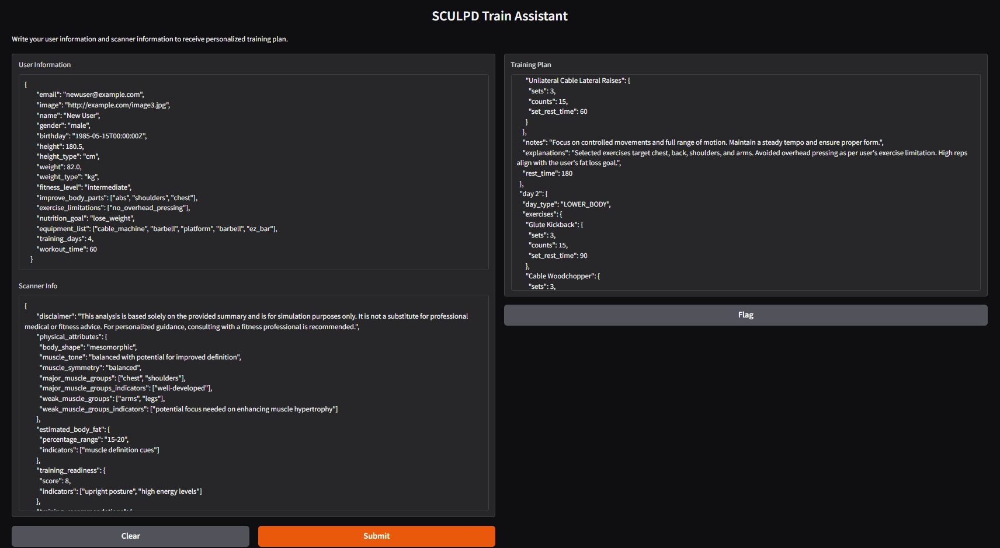

# SculpdAssistant

Assistant microservice of SCULPD APP for fitness.

This microservie is responsible for generating training program based on user information, available equipment, user goals and feedback.

## Prerequisites

- Docker
- 'configs/' directory with all necessary configs
- .env file for local running (with open-ai api key)
- .env.docker file for docker running (with open-ai api key)
- libs from requirements.txt
- open port 8000


## .env file example

``` dotenv
PORT=8000
API_KEY=YOUR_API_KEY_HERE

EXERCISES_RAW_DF_PATH=/app/data/exercises/sculpd_exercise_processed.csv
EXERCISES_CONFIG_PATH=/app/configs/exercises_config.yaml
DATA_PROCESSING_CONFIG_PATH=/app/configs/data_processing_config.yaml
AGE_BASED_ADJUSTMENTS_CONFIG_PATH=/app/configs/age_based_adjustments_config.yaml
TRAIN_ASSISTANT_CONFIG_PATH=/app/configs/train_assistant_config.yaml
TRAIN_WEEKS_TEMPLATES_PATH=/app/configs/week_templates.json
FEEDBACK_CONFIG_PATH=/app/configs/feedback_config.yaml
TRAINING_PROGRAM_EXAMPLES_DIR=/app/configs/training_program_examples
```

## Build and run

```bash
docker-compose build 
docker-compose up -d
```

## API

API based on Fast API and has two post endpoints '/generate_first_week' and '/generate_next_week'.

First one generates a training program for a first week, second one generate training program based on user's previous training week and feedback.

Request payload:

```python
payload = {
    "user_info": {
        "email": "newuser@example.com",
        "image": "http://example.com/image3.jpg",
        "name": "New User",
        "gender": "male",
        "birthday": "1985-05-15T00:00:00Z",
        "height": 180.5,
        "height_type": "cm",
        "weight": 82.0,
        "weight_type": "kg",
        "fitness_level": "intermediate",
        "improve_body_parts": ["abs", "shoulders", "chest"],
        "exercise_limitations": ["no_overhead_pressing"],
        "nutrition_goal": "lose_weight",
        "equipment_list": ["cable_machine", "barbell", "platform", "barbell", "ez_bar"],
        "training_days": 4,
        "workout_time": 60
    },
    "scanner_info": {
        "disclaimer": "This analysis is based solely on the provided summary and is for simulation purposes only. It is not a substitute for professional medical or fitness advice. For personalized guidance, consulting with a fitness professional is recommended.",
        "physical_attributes": {
          "body_shape": "mesomorphic",
          "muscle_tone": "balanced with potential for improved definition",
          "muscle_symmetry": "balanced",
          "major_muscle_groups": ["chest", "shoulders"],
          "major_muscle_groups_indicators": ["well-developed"],
          "weak_muscle_groups": ["arms", "legs"],
          "weak_muscle_groups_indicators": ["potential focus needed on enhancing muscle hypertrophy"]
        },
        "estimated_body_fat": {
          "percentage_range": "15-20",
          "indicators": ["muscle definition cues"]
        },
        "training_readiness": {
          "score": 8,
          "indicators": ["upright posture", "high energy levels"]
        },
        "training_recommendations": {
          "body_development": {
            "upper_body": {
              "chest": ["bench presses", "push-ups"],
              "back": ["pull-ups", "rows"],
              "shoulders": ["shoulder presses", "lateral raises"],
              "arms": ["bicep curls", "triceps dips"]
            },
            "lower_body": {
              "legs": ["squats", "lunges"],
              "calves": ["calf raises"]
            },
            "core": ["planks", "back extensions"],
            "postural_balance": ["face pulls", "seated rows"]
          },
          "body_maintenance": {
            "upper_body": {
              "chest": ["bench presses", "push-ups"],
              "back": ["pull-ups", "rows"],
              "shoulders": ["shoulder presses", "lateral raises"],
              "arms": ["bicep curls", "triceps dips"]
            },
            "lower_body": {
              "legs": ["squats", "lunges"],
              "calves": ["calf raises"]
            },
            "core": {
              "exercises": ["planks", "back extensions"]
            },
            "postural_balance": {
              "exercises": ["face pulls", "seated rows"]
            }
          },
          "fat_loosing": {
            "cardiovascular": []
          }
        }
    },
    "feedback_key": "normal",
    "previous_week": previous_week_json
}
```

## UI



## Testing

To execute unit tests:
```bash
pytest
```

To execute special tests:
```bash
pytest -m special
```

To execute integration tests:
```bash
pytest -m integration
```
